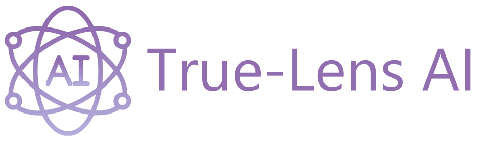

# True-Lens AI

True-Lens AI is an ambitious and forward-thinking project dedicated to analyzing, identifying, and addressing critical concerns related to the safety, bias, and ethical implications of artificial intelligence models. By leveraging advanced analytical techniques, the project seeks to ensure that AI systems operate transparently, fairly, and responsibly, minimizing risks and promoting ethical AI development.

## Who is this for?

True-Lens AI is designed for businesses, researchers, and individuals who seek a reliable and comprehensive method for evaluating their AI models before deployment. It provides a structured framework to assess fairness, detect ethical biases, and ensure that AI-driven systems operate transparently and responsibly. By offering in-depth analysis and actionable insights, True-Lens AI helps organizations build trust in their AI technologies before they are introduced into real-world applications.

## Installation

**Disclaimer:** The requests will not be made without API keys, this can be added in the app.py file temporarily for making requests.

To get an instance up and running, you can ```git clone``` the repository then start up the server with 
```
cd server
pip install flask
pip install flask_cors
pip install requests
pip install transformers
pip install torch torchvision torchaudio
python endpoints.py
```
and the client with
```bash
cd Client
npm install
npm install vite
npm run dev
```
    
## Tech Stack

**Client:** Typescript, React, Redux, TailwindCSS, AntDesign

**Server:** Python, Flask, Pytorch

**Models:** True-Lens AI uses a zero-shot classification which allows for a model that can classify text even without specific training. The model used is Facebook's BART Large MNLI model, which is good for text classification.
## Authors

- [@Adam1277](https://github.com/Adam1277)
- [@JaceMonforton](https://github.com/JaceMonforton)
- [@Axzurey](https://github.com/Axzurey)
- [@eromoselekelvinsmart](https://github.com/eromoselekelvinsmart)
